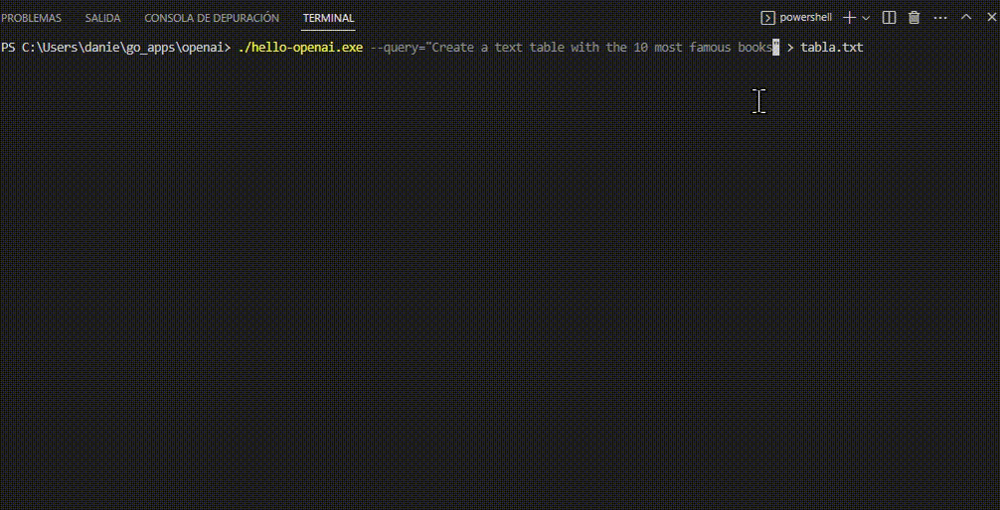

# hello-openai
ℹ️ It is an executable .exe "ready to use" and an easy way to make queries & questions (prompts) to OPENAI, from a command line interface (CLI) for Windows, Linux, and Mac



🚀 Features

+ You can perform automation from the command line. (Powershell, Terminal, command.com, ...)
+ Use it in a script, ready to run from a task. (lots, .bat, "Windows Task Scheduler" ...)
+ You can redirect standard output to a new file ">" or ">>"
+ Terminate the program with an exit code of (1), indicating an error. Use (0) if everything has worked well.
+ Programs that run commands can now call OPENAI directly.
+ Made with love🤟in GOlang
+ Model: GPT3.5Turbo

📋 Requirements: 

A valid APIKEY from https://platform.openai.com/account/api-keys
and set OPENAI_APIKEY Environment variable. For example on Windows Powershell, to set an environment variable: ``` $env:OPENAI_APIKEY = 'YOUR_API_KEY'``` 


🔧 Usage

  hello-openai --query="your prompt here" [options]

Options:

  -help
        Show help information

  -max-tokens int
        Maximum tokens in response (default 1000)
  
  -model string
        OpenAI model to use (gpt-3.5-turbo, gpt-4o, o1-preview, o1-mini) (default "gpt-3.5-turbo") 
  
  -query string
        Prompt to send to the AI
  
  -system string
        System message to set AI behavior
  
  -temperature float
        Temperature for response creativity (0.0-2.0) (default 0.7)
  
  -timeout int
        Request timeout in seconds (default 30)
  
  -verbose
        Show detailed information
  
  -version
        Show version information


💡 Example 1 - simple question:

``` ./hello-openai.exe --query="act as only one word response: ¿What is the capital of Spain?" ``` 
and the output is:
  Madrid.
  
💡 Example 2 - create a text table in spanish:

``` ./hello-openai.exe --query="Comportate como un simulador. Crea una tabla con 5 nombres y un apellido cada uno, con edades entre 18 y 99 años. y un numero de hijos cualquiera. Estos datos son totalmente inventados así que no sean comunes" ``` 
and the output is:
| Nombre    | Apellido   | Edad | Hijos |
|-----------|------------|------|-------|
| Yahaira   | Araujo     | 25   | 2     |
| Gaspar    | Baptiste   | 81   | 7     |
| Aram      | Costa      | 44   | 0     |
| Fausto    | Fortunato  | 64   | 4     |
| Florinda  | Vega       | 18   | 1     |

💡 Example 3 - redirect output to a new file tabla.txt:

``` ./hello-openai.exe --query="crea una tabla de texto con los 10 libros más famosos del mundo" > tabla.txt ```
and the output is a file with the table inside

💡 Example 4 - commands for your terminal/powershell:

``` .\hello-openai.exe --query="Write the PowerShell command to list the files from largest to smallest size, including subdirectories. It doesn't show any explanation, just the command to paste it into the console"  ```

And the output is the new command for your terminal: 

**Get-ChildItem -Recurse | Sort-Object Length -Descending | Select-Object FullName, Length, LastWriteTime**

You can paste & copy on the PowerShell terminal.


--------------------------------------------------------------------

* Disclaimer of responsibilities for executable:

The following executables files are provided as-is and without any warranty or guarantee of any kind, whether express or implied. The use of these executables is at your own risk, and we do not assume any responsibility for any consequences that may arise from its use.

We have taken reasonable steps to ensure that the executable is free from viruses, malware, or any other harmful components. However, we cannot guarantee that the executable is completely free from such elements, and we will not be liable for any damages or losses that may result from any virus, malware, or other harmful components that may infect your system or cause damage to your files.

We will not be responsible for any loss or damage, including, without limitation, indirect or consequential loss or damage, or any loss or damage whatsoever arising from the use of this executable.

By using these executables, you acknowledge that you have read this disclaimer of responsibilities and agree to its terms.

Win Version at Virustotal!: [[17c0d653074d8fcd4f13fd58531afc721e6e60df6d2215de347050bbb13c47f1](https://www.virustotal.com/gui/file/17c0d653074d8fcd4f13fd58531afc721e6e60df6d2215de347050bbb13c47f1?nocache=1)


